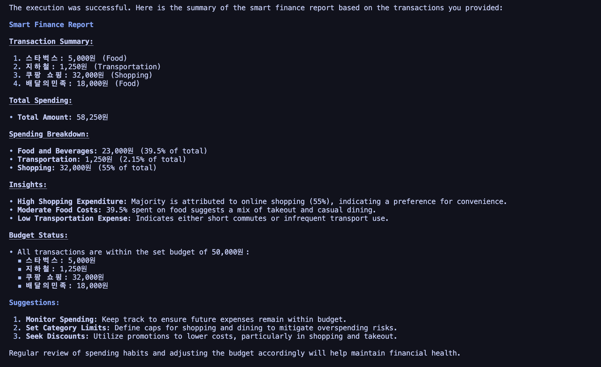

# Smart Finance Agent

## Multi-Agent Smart Finance System using DeepAgents

DeepAgents를 활용하여 구현한 멀티 에이전트 기반 스마트 가계부 시스템입니다.  
이 시스템은 사용자의 소비 내역을 자동으로 분류하고, 소비 패턴을 분석하며, 예산 초과 여부를 판단하고, 최종적으로 금융 리포트를 생성합니다.

---

## Problem Statement

기존 가계부 시스템은 사용자가 직접 입력하고 분석해야 하는 번거로움이 있습니다.  

또한 단일 AI 시스템은 복잡한 금융 분석을 수행하는 데 한계가 있습니다.  

본 프로젝트는 여러 Agent가 협력하는 Multi-Agent 구조를 통해  
자동화된 금융 분석 시스템을 구현하는 것을 목표로 합니다.

---

## Project Goal

- 거래 내역 자동 분류  
- 소비 패턴 분석  
- 예산 비교 및 절약 전략 제안  
- 최종 금융 리포트 생성  

---

## Why Multi-Agent?

이 프로젝트는 단일 Agent가 아닌 여러 Sub-Agent를 사용하는 구조입니다.

각 Agent는 다음과 같은 전문 역할을 수행합니다:

- Classifier → 데이터 분류  
- Analyst → 패턴 분석  
- Budget Planner → 예산 판단  
- Reporter → 결과 정리  

이러한 구조는 복잡한 문제를 단계적으로 해결할 수 있게 하며,  
더 정확하고 해석 가능한 결과를 제공합니다.

🔄 Workflow
거래 데이터 입력
분류 → 분석 → 예산 → 리포트 순으로 처리
최종 결과 출력

---

## Example Output

Below is the result of running the system:



---

## System Architecture

```text
User Input
   ↓
Supervisor Agent
   ├── Classifier Agent
   ├── Analysis Agent
   ├── Budget Planner Agent
   └── Report Generator Agent
   ↓
Final Finance Report
